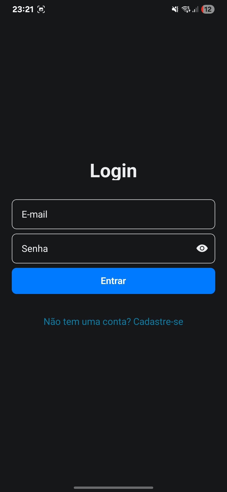
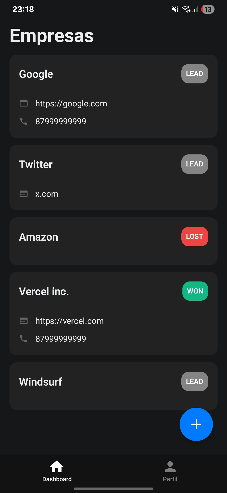
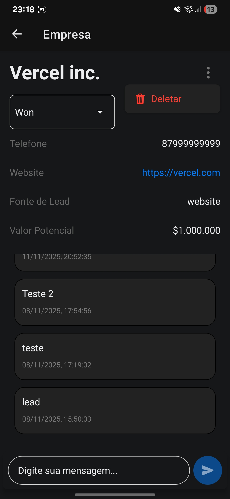

# CRM B2B Mobile

Aplicativo móvel para gerenciamento de relacionamento com clientes (CRM) focado em negócios B2B. Desenvolvido com Expo para oferecer uma experiência nativa em Android e iOS.

## 🚀 Recursos

- 👥 Gerenciamento de empresas e contatos
- 📅 Acompanhamento de interações e negócios
- 🔐 Autenticação segura

## 🛠 Tecnologias

- **Framework**: Expo
- **Autenticação**: Better Auth
- **Backend**: GraphQL

## ⚙️ Como executar

1. Instale as dependências:

   ```bash
   pnpm install
   ```

2. Inicie o servidor de desenvolvimento:

   ```bash
   pnpm start
   ```

3. Escaneie o QR Code com o app Expo Go (Android/iOS) ou use um emulador

## 📱 Capturas de Tela

| Tela de Login                                          | Perfil do Usuário                                       |
| ------------------------------------------------------ | ------------------------------------------------------- |
|  |  |

| Lista de Empresas                                               | Página da Empresa                                               |
| --------------------------------------------------------------- | --------------------------------------------------------------- |
|  |  |
